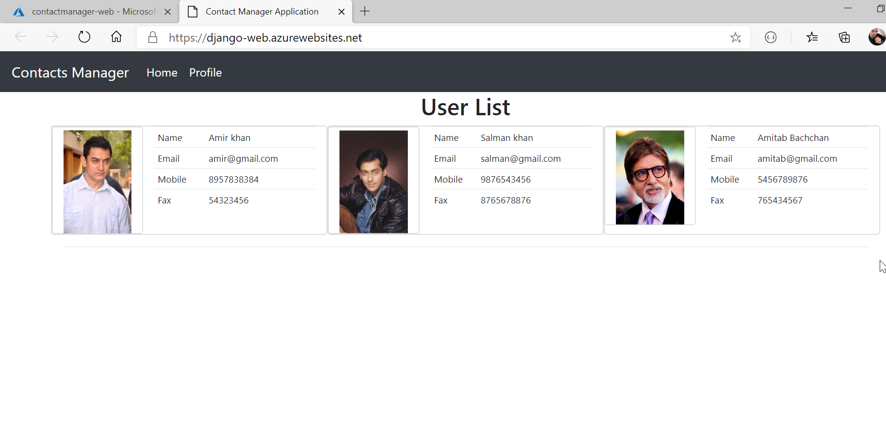

# Python Django on Azure Tutorial 
In this tutorial I am going to demonstrate how to develop a cloud native Django web application that leverages the Azure services such as `Storage account`, `Azure Database for PostgreSQL`, `App Service Web App`, `Application insights`, `Azure Container Registry` and `Azure DevOps`. We will use the `Storage blob service` for serving the static and media files for your Django Web App and `Azure Database for PostgreSQL` for database migrations. We will deploy the application as a Docker container into `App Service Web App` using the `Azure DevOps`. Azure DevOps uses the build pipeline to build and push the image to the `Azure Container Registry` (ACR) and a release pipeline to enable the Continues Deployment to the Web App.

## Prerequisites 
* Python 3.6 or later
* Visual Studio Code
* Python Extension for VS Code
* Azure Subscription
* Azure CLI 2.x
* Azure DevOps account

## Setting up the project
-------------
To start with the tutorial, I am using a precreated Django Web Application that contains a set of web pages. You can also clone or download the project from the [python-on-azure](https://github.com/sonusathyadas/python-on-azure). Download the project and open with Visual Studio Code.

You can now create a Python virtual environment for the application to run the application in an isolated mode. You can install the dependencies for this project within the virtual environment. Follow the steps to setup the Virual environment for yourr Django project in VS Code:
1) Open `Integrated Terminal` in VS Code and run the following command to create a virtual environment. Ensure the project root folder is set as the current directory. (Note: In root folder the `manage.py` file is located)
	> `python -m venv env`
2) Close the `Integrated Terminal` after the virtual environment is created. 
3) Open the Command Palette (View > Command Palette or (Ctrl+Shift+P). Then select the `Python: Select Interpreter command`:
4) It lists the available Python interpreters in the current environment. It lists globally installed python and virtual environment python in `env` folder. Select the virtual env python. (`eg: .\env\Scripts\Python.exe`)
5) Open the integrated terminal .Ensure the default terminal type is `Command Prommpt`. It activates the Python environment using the activation script automatically.
6) Install `Django`, `django-bootstrap4` and `Pillow` packages in the virtual environment by running one of the following commands in the VS Code Terminal:	
	> pip install django django-bootstrap4 Pillow
7) You can now run the following commands to enable database migrations using the default `sqlite3`.
    > python manage.py makemigrations contactmanager

    > python manage.py migrate

8) Run the application by running the command:
    > python manage.py runserver

9) Open browser and navigate to http://localhost:8000.

## Configure Azure Database for PostgreSQL for database 
In our application, Django uses Sqlite as the default database for user tables and admin tables. When you plan to migrate your application to Azure, you also need to think about database migrations. Sqlite is good for local development and test purposes but not good for production. So we can think of any cloud based open-source database solutions. Azure provides open-source database solutions for PostgreSQL, MySQL and MariaDB. In this tutorials we will be using `Azure Database for PostgreSQL` for out database requirements. Perform the following steps to configure `Azure Database for PostgreSQL` in our application.

1) Open the command prompt and login to your Azure subscription. Run the following command to login to your Azure subscription.
    > az login
2) Create a new Azure resource group. Execute the following command to create a resource group.
    > az group create -n AzurePythonGroup -l eastus
3) Create a new `Azure Database for PostgreSQL` instance by running the following command. Replace the **YOUR_PASSWORD** with your database server password.
    > az postgres server create  -n contactdbserver  -g AzurePythonGroup  -l eastus  --admin-user labuser  --admin-password <YOUR_PASSWORD>  --sku-name GP_Gen5_2 
4) Execute the following command to create a firewall rule to allow connections to the PostgreSQL server from all IPs. 
    > az postgres server firewall-rule create --server contactdbserver  -g AzurePythonGroup -n AllowAllIps --start-ip-address 0.0.0.0 --end-ip-address 255.255.255.255
5) Run the following command to get the server DNS name and login username.
    > az postgres server show -g AzurePythonGroup --name contactdbserver --query fullyQualifiedDomainName
    
    > az postgres server show -g AzurePythonGroup --name contactdbserver --query administratorLogin
6) You can use any PostgreSQL client tool to connect to the newly created database. You can use either `psql.exe` or `PgAdmin` to connect to the database server. Create a new database with the name `contactdb`. You can use the `fullyQualifiedDomainName` of the server as host name and `administratorLogin` value along with server name as username. For example, if login name is `labuser` and server name is `contactdbserver` then you can use `labuser@contactdbserver` as the login user name.
7) In our application, we need to install the Postgres pip package to connect to Postgres server. To install the postgres database package run the following command.
    > pip install psycopg2
8) Create a new file `envconfig.py` in the project root folder (next to manage.py) and define a method that configure the environment variables required for the application. Add the following code to the `envconfig.py` file. Replace *<YOUR_PASSWORD>* with your database password value.
    ```
    import os
    
    def set_env_variables():
        # PostgreSQL server configuration
        os.environ['DATABASE_ENGINE'] = 'django.db.backends.postgresql'
        os.environ['DATABASE_NAME'] = 'contactdb'
        os.environ['DATABASE_USERNAME'] = 'labuser@contactdbserver'
        os.environ['DATABASE_PASSWORD'] = '<YOUR_PASSWORD>'
        os.environ['DATABASE_HOST'] = 'contactdbserver.postgres.database.azure.com'
        os.environ['DATABASE_PORT'] = '5432'
    ```
9) Open the `settings.py` from the `contactproject` directory and add the following code to the import section
    ```from envconfig import set_env_variables```
10) After the import statements add the following code to call the `set_env_variables` method to set the evironment variables.
    ```set_env_variables()```
11) Find and replace the `DATABASES` section with the following value in the `settings.py` file.
    ```
    DATABASES = {
        'default': {
            'ENGINE': os.environ.get('DATABASE_ENGINE'),
            'NAME': os.environ.get('DATABASE_NAME'),
            'USER': os.environ.get('DATABASE_USERNAME'),
            'PASSWORD': os.environ.get('DATABASE_PASSWORD'),
            'HOST': os.environ.get('DATABASE_HOST'),
            'PORT': os.environ.get('DATABASE_PORT'),
        }
    }
    ```
12) Run the following command to apply the database migrations. It will generate the tables and other database resources required for the applications.
    > python manage.py migrate
13) Run the application by running the command `py manage.py runserver` and navigate to `http://localhost:8000`. Click on the `profile` link and add a new contact. The contact details will be saved in the new table created in `PostgreSQL` server.

## Configure Storage accout for static and media files
You can now use the Azure storage account blob service for serviing static files such as javascripts, stylesheets and media files such as video and images. To configure the application for serving static files from storage blob service, you need to create a storage account blob container in your Azure subscription.

1) Open the command prompt and login to azure subscriotion. Run the following command to create a new storage account. You can use your own storageaccount name value which is unique.
    > az storage account create -n contactappstorage -g AzurePythonGroup -l eastus --access-tier Hot --kind StorageV2 --sku Standard_LRS
2) Once the storage account is created successfully, run the following commands to create the containers for static files and media files with `blob` public access type.
    > az storage container create -n static --account-name contactappstorage --public-access blob

    > az storage container create -n media --account-name contactappstorage --public-access blob
3) Now, we need to extract the storage account key to configure in our application. Run the following command to list the storage account keys. It will list both the keys of your storage account. You can choose either the storage account key value for `Key1` or `Key2`.
    > az storage account keys list  -n contactappstorage -g AzurePythonGroup

4) To configure storage account services in your application, you need to install `django-storages` and `azure-storage-blob` packages in your application. Run the following command to install the packages using `pip`.
    > pip install django-storages==1.9.1 azure-storage-blob==2.1.0
    
    > [!WARNING]
    > Make sure that you are installing the version `2.1.0` of the `azure-storage-blob` package.

5) Open the `envconfig.py` file in your application and update the code to set list of environment variables for storage account configuration. Add the following code below the PostgreSQL configuration inside the `set_env_variables()`. 
    ```
    def set_env_variables():
        # PostgreSQL server configuration. 
        # Code removed for brevity
        
        # Media and static file Storage configurations
        os.environ['STORAGE_ACCOUNT_NAME'] = '<STORAGE_ACCOUNT_NAME>'
        os.environ['STORAGE_ACCOUNT_KEY']  = '<STORAGE_ACCOUNT_KEY>'
        os.environ['STORAGE_ACCOUNT_DOMAIN'] = '<STORAGE_ACCOUNT_NAME>.blob.core.windows.net'
        os.environ['STORAGE_MEDIA_CONTAINER'] = 'media'
        os.environ['STORAGE_STATIC_CONTAINER'] = 'static'
    ```
    Replace the *STORAGE_ACCOUNT_NAME* and *STORAGE_ACCOUNT_KEY* with the your storage account name and key.
6) Create a new directory `storage` inside the `contactmanger` web application and add a new python file to it. Name the file as `azureblob.py` and add two python classes inside it. First class is used for providing media storage access and another one is for static file storage access. Add the following code to the `azureblob.py` file.
    ```
    from django.conf import settings
    from storages.backends.azure_storage import AzureStorage
    
    class AzureMediaStorage(AzureStorage):    
        account_name = settings.AZURE_ACCOUNT_NAME
        account_key = settings.AZURE_STORAGE_KEY
        azure_container = settings.AZURE_MEDIA_CONTAINER
        expiration_secs = None
        overwrite_files = True
        
    class AzureStaticStorage(AzureStorage):
        account_name = settings.AZURE_ACCOUNT_NAME
        account_key = settings.AZURE_STORAGE_KEY
        azure_container = settings.AZURE_STATIC_CONTAINER
        expiration_secs = None
    ```

7) Open the `settings.py` file and find the static files and media files storage configuration section. Replace the following code 
    ```
    STATIC_URL = '/static/'
    STATIC_ROOT = os.path.join(BASE_DIR, 'static_files')
    MEDIA_URL = '/media/'
    MEDIA_ROOT = os.path.join(BASE_DIR, 'media')
    ```
    with the code given below.
    ```
    AZURE_ACCOUNT_NAME=os.environ.get('STORAGE_ACCOUNT_NAME')
    AZURE_STORAGE_KEY = os.environ.get('STORAGE_ACCOUNT_KEY')
    AZURE_CUSTOM_DOMAIN = os.environ.get('STORAGE_ACCOUNT_DOMAIN')
    AZURE_MEDIA_CONTAINER = os.environ.get('STORAGE_MEDIA_CONTAINER')
    AZURE_STATIC_CONTAINER=os.environ.get('STORAGE_STATIC_CONTAINER')
    
    if(DEBUG):
        STATIC_URL = '/static/'
        STATIC_ROOT = os.path.join(BASE_DIR, 'static_files')
        MEDIA_URL = '/media/'
        MEDIA_ROOT = os.path.join(BASE_DIR, 'media')
    else:
        STATIC_URL = f'https://{AZURE_CUSTOM_DOMAIN}/{AZURE_STATIC_CONTAINER}/'
        MEDIA_URL = f'https://{AZURE_CUSTOM_DOMAIN}/{AZURE_MEDIA_CONTAINER}/'
        STATICFILES_STORAGE = 'contactmanager.storage.azureblob.AzureStaticStorage'
        DEFAULT_FILE_STORAGE = 'contactmanager.storage.azureblob.AzureMediaStorage'
    
    ```
    This will use the local `static` and `media` folders when you run in `Debug` mode. When you move the application to production server it will use the Azure storage blob containers. Before moving the application to production, don't forget to update the value of the `DEBUG` environment variable value to `False` in `settings.py` file.
8) Open the integrated terminal of the VS Code and run the following command to collect all static files in to the `static` container in the storage account. 
    > py manage.py collectstatic
9) Run the application by running the command `py manage.py runserver`. 

## Configure monitoring using Application Insights
Application Insights (AI) is a monitoring service in Azure cloud. It is part of the Azure Monitoring platform. AI can collect the telemetry from the applications running on Azure, on-premise or any other cloud service.Application Insights can collect the telemetry and visualize it in a dashboard with charts and graphs. You can also monitor the live metrics coming from the application. You can also create `URL Ping test` to check the availability of the application from various regions. Here, we are going to collect the telemetru from the applications using the *Application Insights* middleware in Django application. To enable monitoring in our Django application you need to create an `Application Insights` resource in Azure subscription.

1) Application Insights commands may not be installed in you local Azure CLI intallation. To enable Application Insights commands in your local Azure CLI installation you need to add `application-insights` extension to it. Run the following command to add the extension.
    > az extension add --name application-insights

2) Run the following command to create an `Application Insights` resource using Azure CLI.
    > az monitor app-insights component create --app django-web --location eastus --kind web -g AzurePythonGroup --application-type web

3) Run the command to extract the instrumentation key of the application insights. You can note this in a text file which need to be placed in the Application Insights configuration.
    > az monitor app-insights component show --app django-web -g AzurePythonGroup --query "instrumentationKey"

4) Open the `envconfig.py` file and add set the `Application Insights` instrumentaion key as an environment variable. Add the following line at the end of the `set_env_variables()` function.
    ```    
    # Set Application Insights Key
    os.environ['APP_INSIGHTS_KEY'] = '<YOUR_APP_INSIGHTS_KEY_HERE>'
    ```
5) Install the `applicationinsights` pip package to the application.
    > pip install applicationinsights

6) Open the `settings.py` file from the `contactproject` folder and configure the `applicationinsights.django.ApplicationInsightsMiddleware` middleware in the `MIDDLEWARE` collection.
    ```
    MIDDLEWARE = [
        ....
        'applicationinsights.django.ApplicationInsightsMiddleware'    
    ]
    ```
7) Add an `APPLICATION_INSIGHTS` area to your settings with the instrumentation key loaded from an environment variable. Also, configure the `LOGGING` for the application insights. Add the following code in the `settings.py` file.

    ```
    APPLICATION_INSIGHTS = {
        # (required) Your Application Insights instrumentation key
        'ikey': os.environ.get('APP_INSIGHTS_KEY'),
    
        'use_view_name': True,
        'record_view_arguments': True,        
        'log_exceptions': True,
        'send_interval': 1.0, # Check every second
        'send_time': 3.0, # Wait up to 3 seconds for an event
    }
    if not DEBUG:
        LOGGING = {
            'version': 1,
            'disable_existing_loggers': False,
            'handlers': {
                # The application insights handler is here
                'appinsights': {
                    'class': 'applicationinsights.django.LoggingHandler',
                    'level': 'WARNING'
                }
            },
            'loggers': {
                'django': {
                    'handlers': ['appinsights'],
                    'level': 'WARNING',
                    'propagate': True,
                }
            }
        }        
    ```
8) Run the application and watch the Application Insights dashboard to see the telemetry coming from your application.

    

## Deploying to Web App for Containers using Docker and Azure Container Registry

Docker is one of the most commonly used deployment approach for modern applications. You can containerize the application with all its dependencies and deploy to any supported environment. You can containerize the Django application and push the image to Azure Container Registry (ACR). Azure Container Registry is a private registry for docker containers which can be used to deploy the containerized application to App Service, Kubernetes cluster or Azure Container Instances (ACI). In this tutorial, we will be using the Azure App Service Web App for Containers to deploy our Django application container.

1) Create an Azure Container Registry using the following Azure CLI command. You can use a unique name for your ACR resource.
    > az acr create -g AzurePythonGroup --name pythonacr --sku Basic --admin-enabled

2) We are now preparing our application for production deployment. You need to perform certain updations in your project. The first update is to set the `DEBUG` environment variables value to `False`. Open the  `settings.py` and update the `DEBUG` value to `False`.
3) Another update required for setting the application for production is to generate a `requirements.txt` file. This file can contain the list of dependencies required for the application. You can copy the project files along with the `requirements.txt` file. Run the following command to create the `requirements.txt` file.
    > pip freeze requirements.txt

4) Create a `Dockerfile` in the project root folder. (Project root folder is outside the `contactproject` directory where the `manage.py` is located). Add the following code to the `Dockerfile`.
    ```
    FROM python:3.7

    RUN apt-get update \
        && apt-get install -y --no-install-recommends \
            postgresql-client \
        && rm -rf /var/lib/apt/lists/*
    
    WORKDIR /usr/src/app
    COPY requirements.txt ./
    RUN pip install -r requirements.txt
    COPY . .
    
    EXPOSE 80
    CMD ["python", "manage.py", "runserver", "0.0.0.0:80"]
    ```
5) Create a `.dockerignore` file in the same directory with the following content.
    ```
    __pycache__/
    .vscode/
    env/    
    Readme.md
    ```
6) Now, you application is ready for containerization. You can build and push the docker image to the ACR you have created above. To do that you need to login to the ACR and run the `az acr build` command to build and push the image to ACR. Run the following commands to login and push the image to ACR.
    > az acr login -n pythonacr

    > az acr build -t contactmanager:{{.Run.ID}} -r pythonacr  .

    > [!NOTE]
    > *RUN.ID* is used to assign the current build number as the image tag value.
    
    Once the build and push process is completed, the Run ID will be displayed in the terminal. (eg: `Run ID: ca1 was successful after 2m24s`). Note the Run ID to a text file which we require to deploy the application.

7) Create an App Service Plan for deploying the Web App.
    > az appservice plan create -n PythonAppPlan -g AzurePythonGroup --sku S1 --is-linux

8) Create an App Service Web App to deploy the docker image you have pushed into the ACR.
    > az webapp create -n contactmanager-web -g AzurePythonGroup -p PythonAppPlan -i pythonacr.azurecr.io/contactmanager:<TAG>

    > [!NOTE]
    > Replace the *TAG* with the newly created image tag value (eg: `ca1` in the above example).

9) Once the deployment is completed, you can navigate to the Web App URL to view the contact manager application.

    

> [!NOTE]
> Each `services.Add{SERVICE_NAME}` extension method adds (and potentially configures) services. For example, `services.AddMvc()` adds the services Razor Pages and MVC require. We recommended that apps follow this convention. Place extension methods in the [Microsoft.Extensions.DependencyInjection](/dotnet/api/microsoft.extensions.dependencyinjection) namespace to encapsulate groups of service registrations.
